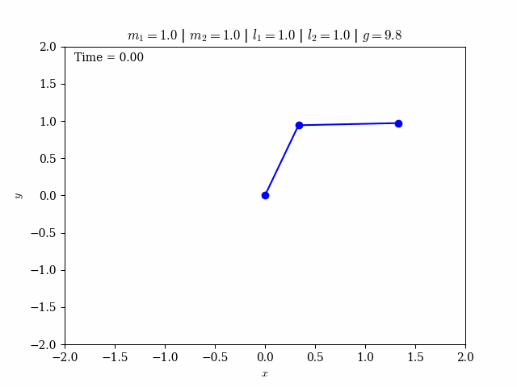

# double-pendulum
Simulation of the motion of a double pendulum using Python.

The equations of motion were obtained using Lagrangian mechanics and integrated using RK4.

File 'integration.py' contains the equations of motion and the RK4 function.

File 'plots.py' contains the functions used to plot variables and make the animation, even functions not used on the main script.

File 'double_pendulum.py' contains the main script. If called without arguments, it will run the simulation with default parameters 
($m_1$, $m_2$, $l_1$, $l_2$, $g$ and $tmax$) and random initial conditions ($\theta_{1_0}$, $\theta_{2_0}$, $\dot\theta_{1_0}$, $\dot\theta_{2_0}$). If called with arguments, you must specify them as

``$ python double_pendulum.py %theta1 %theta2 %dtheta1 %dtheta2 %m1 %m2 %l1 %l2 %g %tmax``

where each argument will be read as a ``float``.
